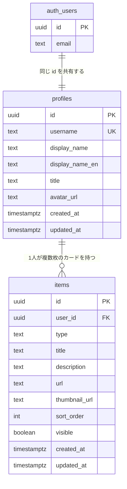

# Hubpin

分散した発信（ブログ・Zenn・X・GitHub・自作アプリ）を1枚のページに集約するハブサイト。

🌐 https://hub.mt-tk.com

- **公開ページは ISR で静的配信**、**編集画面は認証 + RLS** で保護する
- 使うのは自分1人だが、**マルチユーザー前提のスキーマ**にしてある（`/[username]` でルーティング）

## デモ

**アカウント登録なしで編集画面を触れます。**

→ **https://hub.mt-tk.com/login** の「**デモとしてログイン**」

カードの追加・編集・並び替えと、その結果が公開ページへ反映されるところまで試せます。
デモのデータは**ログインのたびに初期状態へ戻る**ので、いつ来ても同じ状態から始まります。

## 技術スタック

|                    |                                                             |
| ------------------ | ----------------------------------------------------------- |
| フレームワーク     | Next.js 16（App Router）/ React 19 / TypeScript（`strict`） |
| データベース・認証 | Supabase（PostgreSQL）                                      |
| スタイル           | Tailwind CSS v4                                             |
| ホスティング       | Vercel                                                      |
| CI                 | GitHub Actions（`build` を必須チェックに設定）              |

## データモデル



> `auth_users` は Supabase Auth が管理する `auth.users` テーブル。
> Mermaid がドットを含む名前を扱えないため、図の中だけ `auth_users` と表記している。

### 制約と、その理由

| 対象                          | 制約                                                                                   | なぜ                                                                                                                                                          |
| ----------------------------- | -------------------------------------------------------------------------------------- | ------------------------------------------------------------------------------------------------------------------------------------------------------------- |
| `profiles.id`                 | `references auth.users(id) on delete cascade`                                          | Auth のユーザーと1対1。**アカウントを消せばプロフィールも消える**                                                                                             |
| `profiles.username`           | `unique` ＋ `check (username ~ '^[a-z0-9_-]{3,30}$')`                                  | **URL（`/[username]`）そのものになる**ので、使える文字を DB 側で縛る                                                                                          |
| `profiles.username`           | `check (username not in ('about','dashboard','login','api','auth','_next','favicon'))` | アプリのルートと衝突する語を予約。**アプリのバリデーションは書き忘れるが、DB の制約は必ず通る**                                                               |
| `items.user_id`               | `references public.profiles(id) on delete cascade`                                     | 持ち主が消えたらカードも消える                                                                                                                                |
| `items.type`                  | `check (type in ('link','note','feed'))`                                               | `enum` を使わなかったのは、**値の追加に `alter type` が要り、同一トランザクション内で追加値を使えない**ため。`text` ＋ `CHECK` なら制約を張り替えるだけで済む |
| `items (user_id, sort_order)` | インデックス                                                                           | 公開ページの読み方が**「この人のカードを並び順で全部」しかない**ため                                                                                          |
| `updated_at`                  | `before update` トリガーで自動更新                                                     | **アプリ側で入れると必ず書き漏れる**ので DB 側で強制する                                                                                                      |

### RLS と GRANT の二段構え

権限は2段階で決まる。**RLS だけでは足りない。**

```
リクエスト
   │
   ├─ GRANT … そもそもこのテーブルに触れるか
   │
   └─ RLS   … 触れるとして、どの行か（auth.uid() = user_id）
```

| ロール                          | `profiles`          | `items`                                   |
| ------------------------------- | ------------------- | ----------------------------------------- |
| `anon`（未認証）                | `select`            | `select`                                  |
| `authenticated`（ログイン済み） | `select` / `update` | `select` / `insert` / `update` / `delete` |

Supabase の標準は「**全部 GRANT して RLS だけで制御する**」だが、それを採らなかった。
**未認証が書き込む正当な理由が無いなら、RLS で弾く前に権限そのものを渡さない**方が、
防御が1枚ではなく2枚になる。

公開ページが未認証でも読めるのは `using (true)`（`profiles`）と
`using (visible = true)`（`items`）の2本。書き込み系はすべて `auth.uid() = user_id` で本人に閉じる。

- ポリシーの実物 → [`supabase/migrations/`](./supabase/migrations/)
- 検証用SQL（期待値コメント付き） → [`supabase/rls_checks.sql`](./supabase/rls_checks.sql)

> **v1.1 で `pages` テーブル（作品の下層ページ）を追加する予定**。
> 設計はしたが v0.5 では実装していない。

## セットアップ

```bash
npm install
cp .env.example .env.local   # 値は Supabase ダッシュボードから取得する
npm run dev
```

http://localhost:3000 で起動する。環境変数は `.env.example` を参照。
