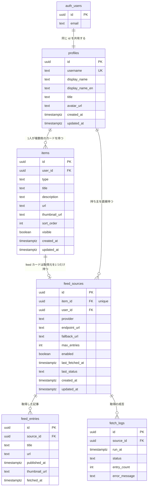

# Hubpin

分散した発信（ブログ・Zenn・X・GitHub・自作アプリ）を1枚のページに集約するハブサイト。

🌐 https://hub.mt-tk.com

- **公開ページは ISR で静的配信**、**編集画面は認証 + RLS** で保護する
- 使うのは自分1人だが、**マルチユーザー前提のスキーマ**にしてある（`/[username]` でルーティング）

## デモ

**アカウント登録なしで編集画面を触れます。**

→ **https://hub.mt-tk.com/login** の「**デモログイン**」

カードの追加・編集・並び替えと、その結果が公開ページへ反映されるところまで試せます。
デモのカードは**ログインのたびに初期状態へ戻る**ので、いつ来ても同じ状態から始まります。

## 技術スタック

|                    |                                                                  |
| ------------------ | ---------------------------------------------------------------- |
| フレームワーク     | Next.js 16（App Router）/ React 19 / TypeScript（`strict`）      |
| データベース・認証 | Supabase（PostgreSQL）                                           |
| フィード取得       | Vercel Cron（1日1回）/ RSS・REST API                             |
| スタイル           | Tailwind CSS v4                                                  |
| テスト             | Vitest / React Testing Library                                   |
| ホスティング       | Vercel                                                           |
| CI                 | GitHub Actions（`lint` → `format:check` → `test:run` → `build`） |

## データモデル



> `auth_users` は Supabase Auth が管理する `auth.users` テーブル。
> Mermaid がドットを含む名前を扱えないため、図の中だけ `auth_users` と表記している。

マイグレーションは17本。すべて [`supabase/migrations/`](./supabase/migrations/) にある。

### 制約と、その理由

| 対象                                          | 制約                                                                                   | なぜ                                                                                                                                                          |
| --------------------------------------------- | -------------------------------------------------------------------------------------- | ------------------------------------------------------------------------------------------------------------------------------------------------------------- |
| `profiles.id`                                 | `references auth.users(id) on delete cascade`                                          | Auth のユーザーと1対1。**アカウントを消せばプロフィールも消える**                                                                                             |
| `profiles.username`                           | `unique` ＋ `check (username ~ '^[a-z0-9_-]{3,30}$')`                                  | **URL（`/[username]`）そのものになる**ので、使える文字を DB 側で縛る                                                                                          |
| `profiles.username`                           | `check (username not in ('about','dashboard','login','api','auth','_next','favicon'))` | アプリのルートと衝突する語を予約。**アプリのバリデーションは書き忘れるが、DB の制約は必ず通る**                                                               |
| `items.user_id`                               | `references public.profiles(id) on delete cascade`                                     | 持ち主が消えたらカードも消える                                                                                                                                |
| `items.type`                                  | `check (type in ('link','note','feed'))`                                               | `enum` を使わなかったのは、**値の追加に `alter type` が要り、同一トランザクション内で追加値を使えない**ため。`text` ＋ `CHECK` なら制約を張り替えるだけで済む |
| `items (user_id, sort_order)`                 | インデックス                                                                           | **公開ページの読み方が「この人のカードを並び順で全部」しかない**ため                                                                                          |
| `feed_sources.item_id`                        | `unique` ＋ `references public.items(id) on delete cascade`                            | **ER 図の「1対1」を守っているのはこの `unique`**。2本目が同じカードに刺さると、表示側がどちらを出すか決められなくなる                                         |
| `feed_sources.provider`                       | `check (provider in ('wordpress','zenn','github'))`                                    | 値を1つ増やすたびにアダプターの実装が要る。**取りに行くコードが無い値を、DB に入れさせない**                                                                  |
| `feed_sources.max_entries`                    | `check (max_entries between 1 and 10)`                                                 | 上限が無いと、1回の取得で数百件が入りうる                                                                                                                     |
| `feed_entries`                                | **`user_id` を持たせていない**                                                         | 持ち主は `source_id` から辿れる。RLS が2段辿ることになるが、**持ち主が2箇所にあって片方だけ更新される**ほうが重い                                             |
| `feed_entries (source_id, published_at desc)` | インデックス                                                                           | 読み方が「このソースの記事を新しい順に数件」しかないため                                                                                                      |
| `updated_at`                                  | `before update` トリガーで自動更新                                                     | **アプリ側で入れると必ず書き漏れる**ので DB 側で強制する                                                                                                      |

### RLS と GRANT の二段構え

権限は2段階で決まる。**RLS だけでは足りない。**

```
リクエスト
   │
   ├─ GRANT … そもそもこのテーブルに触れるか
   │
   └─ RLS   … 触れるとして、どの行か（auth.uid() = user_id）
```

| ロール                          | `profiles` | `items`                                   | `feed_sources`      | `feed_entries`                 | `fetch_logs` |
| ------------------------------- | ---------- | ----------------------------------------- | ------------------- | ------------------------------ | ------------ |
| `anon`（未認証）                | `select`   | `select`                                  | `select`            | `select`                       | —            |
| `authenticated`（ログイン済み） | `select`   | `select` / `insert` / `update` / `delete` | `select`            | `select`                       | `select`     |
| `service_role`（Cron）          | `select`   | —                                         | `select` / `update` | `select` / `insert` / `delete` | `insert`     |

Supabase の標準は「**全部 GRANT して RLS だけで制御する**」だが、それを採らなかった。
**未認証が書き込む正当な理由が無いなら、RLS で弾く前に権限そのものを渡さない**方が、
防御が1枚ではなく2枚になる。

公開ページが未認証でも読めるのは4本のポリシー（`profiles` は全行、`items` は `visible = true`、
`feed_sources` と `feed_entries` はぶら下がっているカードが公開のときだけ）。
書き込み系はすべて `auth.uid() = user_id` で本人に閉じる。

#### ロールを指定しないと、ポリシーは足し算される

`items` の SELECT は、当初こう書いていた。

```sql
-- 公開ページ用
create policy "..." on public.items for select using (visible = true);
-- 本人用
create policy "..." on public.items for select using (auth.uid() = user_id);
```

PostgreSQL の PERMISSIVE ポリシーは **OR で結合される**。そのためログイン中は
`(visible = true) OR (auth.uid() = user_id)` になり、**他人の公開カードまで見えていた**。

**用途で2本に分けたつもりが、適用先のロールで分けていなかった**のが原因。
公開ページは cookie を持たない専用クライアント（＝`anon`）で読むので、
`to anon` を付けて役割を固定した。

#### RLS が守らない場所が3つあった

上のように RLS を直しても、**RLS の外側に残る穴**が別にある。実装中に3種類見つけた。

**1. GRANT が無いと、RLS に届く前に落ちる。しかもレスポンスは 200 のまま**

`service_role` が素通りするのは RLS（関所②）だけで、GRANT（関所①）は効く。
Cron から公開ページを再検証するとき `profiles.username` を読むが、
`profiles` には `service_role` への GRANT が1つも無かった。

叩くと `permission denied for table profiles` が出て、**再検証だけが静かにスキップされた。
フィードの取得自体は成功しているので、レスポンスは 200 だった**。
「エラーが出れば気づける」が通じない形で落ちる。

**2. `TRUNCATE` には RLS が効かない**

ポリシーが適用されるのは `SELECT` / `INSERT` / `UPDATE` / `DELETE` だけで、
`TRUNCATE` はテーブル単位の権限としてポリシーを見ない。
**「RLS があるから大丈夫」が唯一通じない権限がこれ。**

Supabase 初期の `grant all` の残りが、3ロール × 5テーブルに取り残されていた。
実測した限り現時点で `anon` から届く経路は無い（PostgREST は `TRUNCATE` を発行しない）。
それでも剥がしたのは、**「今は届かない」が「経路が無い」ではない**ため。
`anon` から呼べる SQL 関数を1つ足した日に、RLS が守らない場所として残る。

**3. UI が無くても、GRANT は残り続ける**

`feed_sources` に書き込む UI は1つも無い（`src/` に `insert` は0本）のに、
`authenticated` に `insert` / `update` / `delete` が開いていた。
INSERT ポリシーは `with check (auth.uid() = user_id)` で `user_id` しか見ておらず、
**`item_id` は他人のカードでも通る**。公開ページの埋め込みは `item_id` を辿るだけなので、
他人のページに自分のフィードを差し込めた。`endpoint_url` は無検証のまま Cron の
`fetch()` に渡るので、SSRF の入口でもあった。

**これは Issue #24（`profiles` の `update` が編集 UI 無しで開いていた）と同型の再発。**
同じ形が2ヶ月後にもう一度出たので、**権限は画面から辿るのではなく、権限の側から一覧して見る**
ことにした。上の GRANT 表で `authenticated` が `profiles` に `update` を持たないのは、
1回目の結果がそのまま残っているため。

- ポリシーの実物 → [`supabase/migrations/`](./supabase/migrations/)
- ロール指定の修正 → [`20260810070940_fix_items_select_policy.sql`](./supabase/migrations/20260810070940_fix_items_select_policy.sql)
- 上の 1〜3 → [`20260904095603`](./supabase/migrations/20260904095603_grant_profiles_select.sql) /
  [`20260906100704`](./supabase/migrations/20260906100704_revoke_truncate_from_anon.sql) /
  [`20260907085148`](./supabase/migrations/20260907085148_revoke_feed_sources_write_from_authenticated.sql)
- 検証用SQL（期待値コメント付き） → [`supabase/rls_checks.sql`](./supabase/rls_checks.sql)

## フィードの取り込み

`items.type` が `feed` のカードは、中身を手で書かない。**外部から1日1回取ってきて入れ替える。**

|        |                                                                            |
| ------ | -------------------------------------------------------------------------- |
| 対象   | WordPress（REST）/ Zenn（RSS）/ GitHub（REST）                             |
| 実行   | Vercel Cron が `/api/feeds/refresh` を叩く（`0 20 * * *` UTC ＝ JST 5:00） |
| 認証   | `CRON_SECRET` を `Authorization: Bearer` で照合する                        |
| 保存先 | `feed_entries`（取得のたびに、そのソースのぶんを丸ごと入れ替える）         |

### 落ちている時間があることを前提にする

外部サービスは落ちる。**落ちた日に何が起きるか**を先に決めてある。

- **キャッシュではなく保存にした。** 取得結果を DB に持つので、外部が落ちていても
  公開ページには前回の内容が出る。**取得の失敗が、訪問者から見た欠損にならない。**
- **入れ替えは1つの関数（`replace_feed_entries`）の中でやる。** `delete` と `insert` を
  別々に撃つと、`insert` だけ失敗した日にカードが空になる。関数の中は1トランザクションなので、
  `insert` が落ちれば `delete` も戻る。
- **0件を成功として扱わない。** 入れ替える関数は渡されたものにするだけなので、空配列を渡すと
  既存が全部消える。「**取れなかった**」を「**0件だった**」に変換しない。
- **`try` / `catch` は媒体ごとのループの中に置く。** 外に置くと、ブログが落ちた日に
  Zenn と GitHub まで更新されなくなる。
- **失敗したソースの持ち主は再検証しない。** 中身が変わっていないページを作り直しても、
  キャッシュを捨てるだけで得が無い。
- **`CRON_SECRET` が未設定なら全部 401 にする。** 判定を `authHeader !== ...` だけにすると、
  未設定の環境では `Bearer undefined` を送れば誰でも通る入口ができる。

## テストが固定していること

テストは7ファイル。**「何本あるか」ではなく「何を固定しているか」で書く。**

| 対象                      | 固定していること                                                                                             |
| ------------------------- | ------------------------------------------------------------------------------------------------------------ |
| フィードのアダプター3媒体 | 正規化・UTC としての日付解釈・**失敗したら例外にすること**・フォールバックを使う順序                         |
| Cron の入口               | **`CRON_SECRET` が未設定なら 401**（未設定を「認証なし」に読み替えない）                                     |
| Cron の障害設計           | 0件なら書き込まない／1媒体が落ちても残りは保存される／失敗が `fetch_logs` に残る                             |
| 入力スキーマ              | `type` ごとに必須項目が変わること（`link` は URL、`note` は本文）・文字数の境界                              |
| 並び替えの UI             | 先頭では「上へ」だけが無効になること／**無効でも `disabled` を付けない**（押した瞬間にフォーカスが飛ぶため） |

### 通る本数と、守れている範囲は別

工程の締めで、**実装をわざと10箇所壊して全部走らせた。結果は全部緑だった**
（→ [#49](https://github.com/Matsutake29/hubpin/issues/49)）。
たとえば「上へ移動」のボタンに `'down'` を渡しても、テストは1本も落ちない。

**本数を書くと「その本数ぶん守られている」と読まれる。それは実測と違う**ので、本数は書いていない。
穴の場所は Issue に列挙してある。

## 速さの実測

公開ページは ISR で静的配信している。Lighthouse（CLI 13.4.1）で、デスクトップ3回・モバイル4回を測った。

|              | 測定回数 | `performance`         |
| ------------ | -------- | --------------------- |
| デスクトップ | 3回      | **100 / 100 / 100**   |
| モバイル     | 4回      | **89 / 70 / 99 / 69** |

`performance` 以外の4カテゴリ（`accessibility` / `best-practices` / `seo` / `agentic-browsing`）は
**7回すべて 100** だった。

### 1回の値を「実力」として書かないことにした

モバイルは**同じページ・同じツール・同じ設定で30ポイント揺れた**。
揺れたのは FCP（1.2〜4.3秒）と LCP（2.2〜5.6秒）だけで、
**TBT（10〜20ms）と CLS（0）は4回とも動かなかった**。
描画の開始が遅れているだけなので、**測定した側の回線の影響**と判断した。

**同じことが過去の測定にも言える。** v0.5 の時点では「全項目 100」と記録していたが、
**それも1回の測定値**だった。4回測れば 69 が出る条件だったので、
**「v0.5 は速く、v1.0 で落ちた」という比較は成立しない。**

### 揺れなかったものは実装の話

|            | v0.5    | v1.0        |
| ---------- | ------- | ----------- |
| ページ総量 | 377 KiB | **656 KiB** |
| 未使用 JS  | 51 KiB  | **123 KiB** |
| 未使用 CSS | 35 KiB  | 35 KiB      |

**4回とも同じ値**なので、こちらは回線ではなく実装。v1.0 で機能が増えたぶん確実に重い。
未使用 CSS の 35 KiB は v0.5 から変わっていないので、**今回増えたぶんは JS のほう**。
削る作業は [#52](https://github.com/Matsutake29/hubpin/issues/52) に切ってある。

## 今後の展望

v1.0 で**落としたもの**と、その理由。

| 落としたもの                             | なぜ落としたか                                                                                                       |
| ---------------------------------------- | -------------------------------------------------------------------------------------------------------------------- |
| **並び替えの D&D 化**                    | ↑↓ ボタンで「コードを触らずに並び替えられる」は満たしている。**D&D は操作感の改善で、できることは増えない**          |
| **カードの自由配置（x/y 座標）**         | ピンボードに見えるのは CSS だけで、**データ構造には要らない**。座標を持つと画面幅ごとに破綻する                      |
| **Bento Grid の作り込み**                | 移植元は枚数が固定で、手で調整して成立していた。**枚数が DB から可変で来ると破綻する**ので、レイアウトごと再設計した |
| **動的 OGP 画像**                        | 静的な OGP で足りている。生成を挟むと、**静的配信の速さと引き換え**になる                                            |
| **`pages` テーブル（作品の下層ページ）** | 設計はした。**ただし「分散した発信を1枚に集める」のが目的**なので、下層を足すと目的と逆を向く                        |

## セットアップ

```bash
npm install
cp .env.example .env.local   # 値は Supabase ダッシュボードから取得する
npm run dev
```

http://localhost:3000 で起動する。環境変数は `.env.example` を参照。

### コマンド

| コマンド               | 内容                                         |
| ---------------------- | -------------------------------------------- |
| `npm run dev`          | 開発サーバー                                 |
| `npm run test`         | テスト（watch）                              |
| `npm run test:run`     | テストを1回だけ実行して終了する（CI と同じ） |
| `npm run lint`         | ESLint                                       |
| `npm run format`       | Prettier で整形する                          |
| `npm run format:check` | 整形されているかを確認する（CI と同じ）      |
| `npm run build`        | 本番ビルド                                   |

CI（GitHub Actions）は `npm ci` → `lint` → `format:check` → `test:run` → `build` の順で走る。
**`build` が最も重いので、整形や挙動で落ちるならその前に分かったほうがいい**という並びにしてある。
